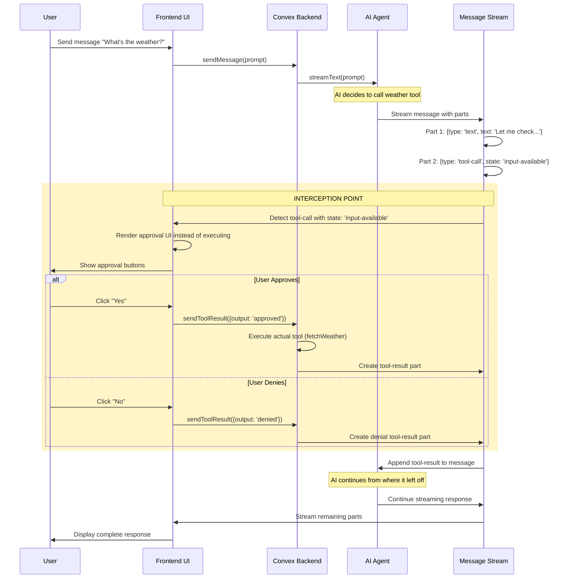

# AI Message Format & Tool Call Interception Architecture

## Overview
This diagram illustrates how the AI messaging system enables Human-in-the-Loop (HITL) approval by leveraging the message data structure to intercept tool calls and manually patch in results.

## Message Data Format

```mermaid
graph TB
    subgraph "Message Structure"
        Message[AI Message]
        Message --> Role[role: 'assistant' | 'user' | 'tool']
        Message --> Parts[parts: Array]
        
        Parts --> TextPart[Text Part]
        Parts --> ToolCallPart[Tool Call Part]
        Parts --> ToolResultPart[Tool Result Part]
        
        TextPart --> TPType[type: 'text']
        TextPart --> TPContent[text: string]
        
        ToolCallPart --> TCType[type: 'tool-call']
        ToolCallPart --> TCId[toolCallId: string]
        ToolCallPart --> TCName[toolName: string]
        ToolCallPart --> TCState[state: 'input-available']
        ToolCallPart --> TCInput[input: object]
        
        ToolResultPart --> TRType[type: 'tool-result']
        ToolResultPart --> TRId[toolCallId: string]
        ToolResultPart --> TRName[toolName: string]
        ToolResultPart --> TROutput[output: any]
    end
    
    style Message fill:#e1f5fe
    style Parts fill:#fff3e0
    style ToolCallPart fill:#fff9c4
    style ToolResultPart fill:#c8e6c9
```

## Tool Call Interception Flow



## Component Interaction Diagram

```mermaid
graph LR
    subgraph "1. Initial Message Flow"
        UserInput[User Input] --> SendMsg[sendMessage]
        SendMsg --> AIStream[AI Streams Response]
    end
    
    subgraph "2. Tool Call Detection"
        AIStream --> MsgParts[Message Parts Array]
        MsgParts --> CheckPart{Part Type?}
        CheckPart -->|text| RenderText[Render Text]
        CheckPart -->|tool-call| CheckState{State?}
        CheckState -->|input-available| InterceptCall[INTERCEPT!]
    end
    
    subgraph "3. Human Approval"
        InterceptCall --> ShowApproval[Show Approval UI]
        ShowApproval --> UserDecision{User Decision}
        UserDecision -->|Approve| CreateApproved[output: 'approved']
        UserDecision -->|Deny| CreateDenied[output: 'denied']
    end
    
    subgraph "4. Manual Patching"
        CreateApproved --> ExecuteTool[Execute Real Tool]
        ExecuteTool --> ToolOutput[Get Tool Result]
        ToolOutput --> CreateResult[Create tool-result part]
        CreateDenied --> CreateResult
        CreateResult --> AppendToStream[Append to Stream]
    end
    
    subgraph "5. Continuation"
        AppendToStream --> AIResumes[AI Resumes with Result]
        AIResumes --> CompleteResponse[Complete Response]
    end
    
    style InterceptCall fill:#ff6b6b,color:#fff
    style ShowApproval fill:#ffd93d,color:#000
    style CreateResult fill:#6bcf7f,color:#fff
```



## Key Architectural Insights

### Why This Works

1. **Message Parts are Structured Data**
   - Messages aren't just text strings - they're arrays of typed parts
   - Each part can be independently processed and rendered

2. **Tool Calls are Message Parts**
   - Tool calls aren't separate from messages - they're just another part type
   - This allows seamless integration in the message flow

3. **State Field Enables Interception**
   - `state: 'input-available'` signals that a tool needs execution
   - UI can detect this and show approval interface instead of executing

4. **Manual Patching is Natural**
   - Adding a `tool-result` part is just appending to the message
   - AI sees the result and continues as if the tool executed normally

5. **Stream Continuity**
   - The AI doesn't know execution was paused
   - It just sees: tool-call → tool-result → continue
   - This maintains context and conversation flow

### Implementation Details

```typescript
// Frontend: Detect and intercept tool calls
if (isToolUIPart(part) && part.state === 'input-available') {
  // Don't execute - show approval UI instead
  return <ApprovalUI onApprove={...} onDeny={...} />
}

// Backend: Manual patch with tool result
const toolResultPart: ToolResultPart = {
  type: "tool-result",
  toolCallId: toolResult.toolCallId,
  toolName: toolResult.tool,
  output: userApproved ? executeRealTool() : "denied"
}

// Stream continues with the patched result
stream.append(toolResultPart)
```

This architecture elegantly solves the HITL problem by treating tool execution as a pausable, resumable part of the message stream rather than a separate system.